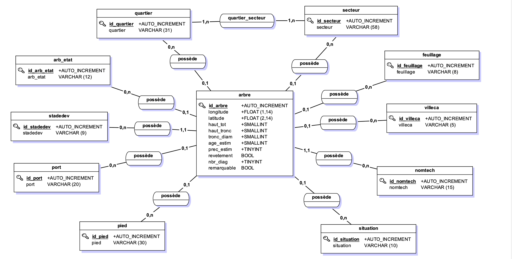
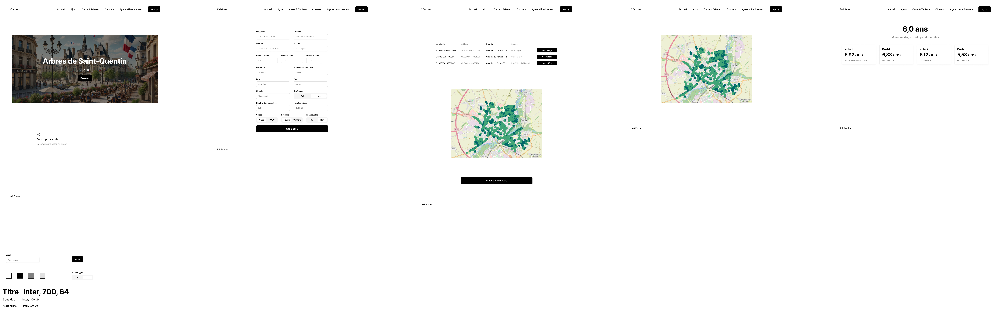

# Projet-Web

aa

## Liste des tâches

|                  | Elouan               | Zelman                |
|------------------|----------------------|-----------------------|
| Lundi matin      | Configuration apache | Figma                 |
| Lundi après-midi | Routes (impossible)  | Figma & Début du html |
| Mardi matin      | SQL                  | Pages PHP             |
| Mardi après-midi | Backend              | Blocks HTML           |

## Fonctionnalités de base

- [ ] Page d'accueil
- [ ] Ajout d'arbres
- [ ] Visualisation tableau et carte
- [ ] Prédiction du cluster
- [ ] Prédiction âge et déracinement

## Rendu Intermédiaire

Les documents se trouvent dans le dossier [rendu intermédiaire](./rendu_intermediaire/)

- [x] Maquette Figma pdf [lien figma](https://www.figma.com/design/wBkDKv9k42slwQ001P6LNQ/ProjetWeb?node-id=0-1&t=xsehOe0UXzx57aVn-1)
- [x] MCD pdf
- [x] Interface Client/Serveur
- [x] Readme d'où trouver les documents

### MCD

### Maquette

### Interfaces Client-Serveur

## Rendu Final

- [ ] Readme
- [ ] Support présentation (avec slide bilan)
- [ ] Partage des tâches pour chaque demi-journée
